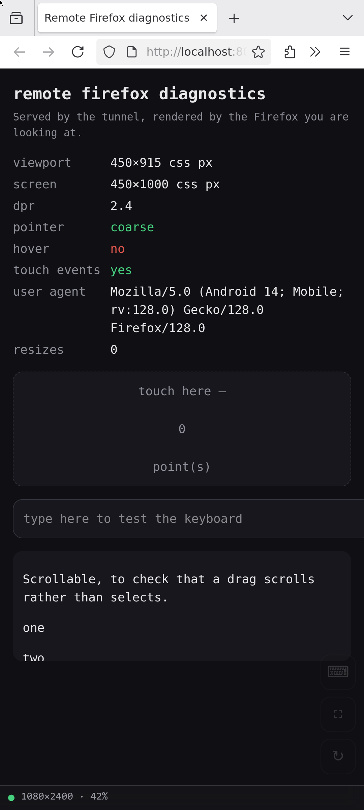
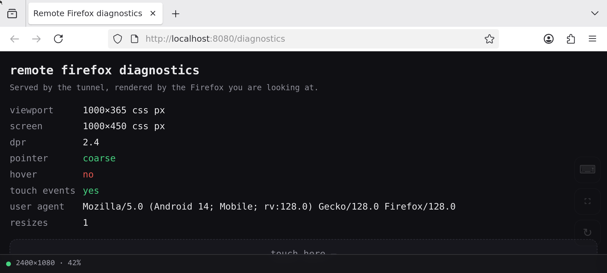

# Try Firefox and Guacamole in Podman

Run Firefox headlessly in a rootless Podman pod and drive it from a phone browser, with
the phone as the *primary* target rather than an afterthought.

The twist that makes this a study rather than a compose copy/paste: **the Java Guacamole
webapp is dropped entirely.** What stays is `guacd`, the C proxy that actually speaks VNC.
What replaces Tomcat is ~250 lines of Python that bridge a browser WebSocket to guacd's
wire protocol. Removing the webapp is also what makes genuinely zero-auth, single-URL
access possible: there is no login form to skip, because there is no auth subsystem.

| | |
|---|---|
|  |  |
| A 450×1000 CSS px phone viewport, and a remote session sized to match it: 1080×2400. | The same session after rotating. The remote reflowed to 2400×1080 — Firefox is genuinely landscape, not scaled down to fit. |

Both screenshots are a real Firefox, phone-shaped, rendering the client page — which is
showing a *second* Firefox running inside the pod. That inner Firefox is an ordinary
browser: real tabs, a real URL bar, a real menu. You can navigate it from the phone.

## Running it

```sh
mise run build     # three images, and vendor guacamole-common-js
mise run up        # one pod, three containers
mise run url       # prints the LAN address to open on your phone
mise run down
```

Everything is driven by `mise`; there is no Makefile, no compose file and no kube YAML.

## Architecture

```
                    pod: firefox-guac   (shared localhost, only :8080 published)
  phone ──http──►  ┌──────────────────────────────────────────────┐
  :8080            │ tunnel  (uv + starlette)              :8080  │
                   │   GET  /             the mobile client       │
                   │   GET  /diagnostics  diagnostic page         │
                   │   WS   /tunnel       ◄──► guacd              │
                   │        │                                     │
                   │        ▼ 127.0.0.1:4822                      │
                   │ guacd   (guacamole/guacd:1.6.0)              │
                   │        │                                     │
                   │        ▼ 127.0.0.1:5900   (vnc)              │
                   │ firefox (sway + wayvnc + firefox)            │
                   │        ▲                                     │
                   │        └── sway IPC, over a shared volume ───┤
                   └──────────────────────────────────────────────┘
```

Containers in a pod share a network namespace, so all three talk over loopback and only
port 8080 is published. 5900 is not reachable from anywhere but the pod, which is what
makes an unauthenticated desktop on it reasonable rather than a hole. There is no
password anywhere in this: wayvnc serves the session to whoever connects, and nothing
inside the pod authenticates anything.

The arrow going back up is the unusual part, and the reason it exists is
[the resize](#rotation-is-a-reconnect): the tunnel reshapes sway's output over an IPC
socket shared between the two containers by a volume. It is the only control path in the
system that is not the Guacamole protocol.

## The protocol

Guacamole instructions are a comma-separated list of length-prefixed elements ending in a
semicolon; the first element is the opcode.

```
6.select,3.rdp;
^      ^ ^   ^
|      | |   +-- terminator
|      | +------ value
|      +-------- separator
+--------------- length of "select"
```

`app/src/guac_tunnel/protocol.py` encodes and decodes these;
`app/src/guac_tunnel/handshake.py` drives connection setup. A real exchange, captured
against guacd 1.6.0 by `mise run up` and a narrating client:

```
client ──► 6.select,3.rdp;
guacd  ──► 4.args,13.VERSION_1_5_0,8.hostname,4.port,6.domain,8.username,…  (1503 chars, 81 parameters)
client ──► 4.size,4.1080,4.2400,2.96;
client ──► 5.audio,8.audio/L8,9.audio/L16;
client ──► 5.video;
client ──► 5.image,10.image/jpeg,9.image/png,10.image/webp;
client ──► 7.connect,13.VERSION_1_5_0,9.127.0.0.1,4.5900,0.,…
guacd  ──► 5.ready,37.$8ba89709-996d-47d7-918c-67aeef19884c;

           …and the session stream begins:

guacd  ──► 5.mouse,1.0,1.0,10.1125589696,8.10707530;
guacd  ──► 4.size,2.-1,2.11,2.16;
guacd  ──► 3.img,1.1,2.12,2.-1,9.image/png,1.0,1.0;
guacd  ──► 4.blob,1.1,232.iVBORw0KGgoAAAANSUhEUgAAAAsAAAAQCAYAAADAvYV+…
guacd  ──► 3.end,1.1;
guacd  ──► 6.cursor,1.0,1.0,2.-1,1.0,1.0,2.11,2.16;
```

Three things in there are worth pausing on.

**`connect` is positional.** Its values line up with the parameter names guacd sent in
`args` — all 52 of them, in that order, with an empty string for each of the 49 we do not
set. Sending only the three we care about connects to garbage rather than failing.

**Slot 0 is a version, not a parameter.** From 1.5.0 guacd puts `VERSION_1_5_0` first in
`args`, and expects the negotiated version echoed back in that slot. Treating it as a
parameter name shifts every subsequent value by one.

**`ready` does not mean connected.** guacd answers `ready` before it has reached wayvnc. A
failure there surfaces later as an `error` instruction *inside* the session stream rather
than as a handshake failure.

## Four things that bit

Each of these failed silently — no exception, no error log, just a black screen or a
wrong-sized one.

### The `dpi` in a `size` instruction is a divisor

To guacd it is not metadata describing the display, it is arithmetic: the
pixel dimensions you asked for are rescaled by `96/dpi` before the server ever sees them.
Asking for 1080×2400 at this phone's real 230 dpi produces a 560×1252 session — not an
error, not a warning, just a session that is the wrong size and a client that letterboxes
it without knowing why.

Measured across a sweep, holding the request at 1080×2400:

| dpi sent | session created |
|---|---|
| 96 | 1080×2400 |
| 144 | 720×1600 |
| 192 | 540×1200 |
| 230 | 560×1252 |

96 is the only value that means what it says. Every bit of scaling in this study is
explicit and lives somewhere else — `layout.css.devPixelsPerPx` inside Firefox,
`display.scale()` in the client — so the tunnel now always sends 96, and the pixels
requested are the pixels allocated.

### The browser's tunnel keeps no buffer between messages

`guacamole-common-js` parses each WebSocket message on its own and fails the connection
with `Incomplete instruction.` on any message that ends mid-instruction. The bridge was
forwarding raw TCP chunks straight through, and TCP splits wherever it likes. Sessions
connected, handshook, and died ~285 ms later with nothing rendered.

Forwarding is now re-split on instruction boundaries (`InstructionParser.feed_complete`),
holding any partial tail back until the rest arrives. `test_no_message_ever_ends_mid_instruction`
pushes a stream in three-character slices and asserts every message the browser receives
parses standalone.

### `Guacamole.Client` owns `tunnel.oninstruction`

It installs its own handler in its constructor, and that handler is what draws every
frame. Instrumenting the instruction stream by assigning to `tunnel.oninstruction`
disables rendering entirely. Chain onto the existing handler instead.

Relatedly, `WebSocketTunnel` builds its socket URL as `url + "?" + data`, so the tunnel URL
must carry no query string of its own or you get two `?` and lose the parameters.

### Element lengths count characters, not bytes

The protocol is defined over a UTF-8 stream but lengths are in Unicode characters, so
`2.é;` is valid and three bytes long. Counting bytes desynchronises the parser the first
time anything non-ASCII crosses the wire — a clipboard paste, a window title, an accented
keystroke.

## What "mobile first" meant concretely

Getting a desktop Firefox to behave like a phone browser took three specific values, each
verified by reading them back out of a running instance (`mise run up`, then open `/diagnostics`):

**Firefox will not size its window below 450 CSS px**, maximised or not. Ask for less and
the window comes out *wider* than the screen, clipping the right edge of every page. So
the client asks for a framebuffer in *physical* pixels, exactly as a phone panel reports
them — a 450×1000 viewport at a device pixel ratio of 2.4 means 1080×2400 — and
`layout.css.devPixelsPerPx = 2.4` divides it back down, landing exactly on that floor. It
is also why the client clamps its request at 1080 wide: below that, no ratio saves it.

**The pointer capability bitfield is `Coarse=1, Fine=2, Hover=4`.** Setting
`ui.primaryPointerCapabilities` to 2 for "coarse" quietly reports a mouse, and every site
that branches on `(pointer: coarse)` serves its desktop layout.

**Enabling touch events does not expose `ontouchstart`.** `dom.w3c_touch_events.enabled`
turns the events on, but the property that feature detection actually reads stays
undefined until `dom.w3c_touch_events.legacy_apis.enabled` is set too.

Firefox runs as an ordinary browser here — tabs, URL bar, menu, all navigable from the
phone — and filling the screen is no longer something it has to be told. Under X11 this
took two pieces of persuasion: `xulstore.json` seeded with `sizemode: maximized`, and
openbox configured with `<decor>no</decor>` to stop its title bar costing 61 px of a
phone-sized screen. sway needs neither. One window, `default_border none`, and it fills
the workspace; when the output changes shape the window follows, which is the whole of
the rotation story on the compositor's side.

The result, read off the diagnostic page inside the container:

```
viewport      450×915 css px   (1000 minus Firefox's own chrome)
dpr           2.4
pointer       coarse
hover         no
touch events  yes
user agent    Mozilla/5.0 (Android 14; Mobile; rv:128.0) Gecko/128.0 Firefox/128.0
```

On the client side: `100dvh` rather than `100vh` (on a phone `vh` lies about the URL bar),
`viewport-fit=cover` with `env(safe-area-inset-*)` on the controls, `touch-action: none`
and `overscroll-behavior: none` so a drag reaches the remote session instead of
rubber-banding the page, and 44 px tap targets.

## Touch, on something that only understands a mouse

RFB has no touch at all, and nothing on this path wants one: guacd is driven as
a mouse, and a mouse is what Firefox sees. So every gesture has to be translated.
`static/input.js` maps them:

| gesture | sent to the remote |
|---|---|
| tap | move, then left click at that point |
| one-finger drag | **scroll wheel**, not a mouse drag |
| long press (500 ms) | right click |
| two-finger tap | right click |

The drag mapping is the one that matters. `Guacamole.Mouse.Touchscreen` maps a one-finger
drag to a mouse drag, which is correct for a desktop but wrong here: to the remote a mouse
drag means *select text*, so trying to scroll a page smears a selection across it instead.
Dragging emits wheel notches instead, one per 40 px of travel.

Touch and mouse deliberately share one coordinate path —
`Guacamole.Position.fromClientPosition` plus `sendMouseState(state, true)`, which makes the
client divide by the display scale itself — so a tap and a click cannot disagree about
where they landed.

The keyboard needs its own workaround, and this is where the sharpest trap in the whole
study is. Phone keyboards do not report keys: they send `keyCode 229` and commit text, so
keystrokes have to be reconstructed from `beforeinput` on a hidden capture field.

**`Guacamole.Keyboard` cannot be used alongside that.** It calls `preventDefault()` on
every keydown it sees — correct when it owns the keyboard, fatal here, because a cancelled
keydown never inserts text, so the field never emits `beforeinput`. Attaching both produces
a keyboard that does nothing whatsoever, with no error anywhere. It is gone; text comes
from `beforeinput` and keys that produce no text (arrows, Tab, Escape, shortcuts) come from
`keydown` on the same field.

The field is also seeded with filler, because backspace on an empty field has nothing to
delete and so fires no event at all — backspace silently does nothing.

Expand the debug strip to see `last input`: it reports the gesture and the remote
coordinates actually sent.

## Leaving X11, and what it took

The X11 version of this study was heavy, and all of the weight was X11's: `xorgxrdp`,
`xserver-xorg-core`, `xserver-xorg-legacy`, xrdp, `xrdp-sesman`, an `Xwrapper.config`
exemption to let a non-console user start an X server, a real Unix password in
`/etc/shadow` for PAM to check, and a container running as root. None of that was wanted.
All of it was the price of one feature — the RDP **Display Control channel**, which is
what makes the session reflow when the phone rotates instead of letterboxing, and which is
why this study left VNC in the first place.

It is all gone. sway on a headless wlroots backend is the display and the window manager
in one unprivileged process, wayvnc publishes it, and Firefox is an ordinary Wayland
client. No session manager, no PAM, no password, no root — and the session no longer waits
for someone to connect before it exists.

Getting there meant discarding a working design first. **weston has an RDP backend built
in**, which looks like the obvious answer and is not:

- guacd 1.5.5 renders *nothing* against it — it connects, negotiates, carries input,
  reports completed frames, and never paints a pixel. A FreeRDP 3 client against the same
  weston at the same moment gets a perfect picture. 1.5.5 is built against FreeRDP 2;
  weston 14 links FreeRDP 3.15.
- weston never opens the Display Control channel. `rdpdisp.c` takes the monitor layout
  from capability exchange and from nothing else, in 14 and in 16 alike, so
  `resize-method=display-update` does not fail quietly — it ends the connection.
  `resize-method=reconnect` works, at 1.1 to 2.1 seconds a rotation.
- And weston creates a `wl_seat` **per RDP peer**. There is no seat at all until someone
  connects, so a Firefox started on an empty compositor comes up against a compositor with
  no keyboard — GTK says so, at length — and then ignores every click and keystroke for
  the rest of its life while rendering perfectly. Waiting for a seat fixes that and only
  defers it: the seat belongs to *that* peer. Type into the URL bar from one connection
  and then from a second, and it reads `firstpeer`.

wlroots owns `seat0` from the moment it starts, independently of any client. That is the
whole reason this is sway.

## Rotation is a reconnect

Coming back to VNC should have cost the feature that RDP was adopted for, and no longer
does: guacd 1.6 added client-driven resize to its VNC client (GUACAMOLE-1196), and wayvnc
resizes headless outputs by default. On paper the browser asks and the session obliges.

In practice neither end will change the size of a *live* connection. Asking from the
client stops inside guacd at `Screen data has not been initialized, yet` — it will not
send `SetDesktopSize` until the server has sent it an `ExtendedDesktopSize` rectangle, and
wayvnc does not send one for a size that has not changed. Telling it from the server —
`swaymsg output HEADLESS-1 resolution …` under a connected client — gets `Error handling
message from VNC server`, and guacd drops the connection.

So the resize happens where there is no connection to break. Rotating closes the tunnel;
the tunnel reshapes sway's output over an IPC socket shared in from the session container;
the browser reconnects into a session that is already the shape it asked for. sway and
Firefox never restart — they are not the connection — so the page, its scroll position and
its form state all survive. Measured over ten rotations: **0.51 to 0.53 seconds**, every
one landing, with typing into the page still working afterwards.

Two things had to be learned the hard way, and both are in `session.py`:

**Wait half a second after sway agrees.** sway reports the new size before wayvnc has
re-captured at it. Connect inside that gap and guacd gets its first framebuffer at the old
size and an `ExtendedDesktopSize` immediately after — which it cannot parse, so the
connection is over before anything is drawn. wayvnc exposes no state to poll for this.

**Do not hurry the departing client.** wayvnc takes a flat *ten seconds* to admit that a
disconnected client has gone, which is far too long to wait before every rotation. Hanging
up on it instead, with `client-disconnect` over wayvnc's control socket, is faster and
fatal: a resize after a control-socket disconnect segfaults wayvnc every time, and takes
sway, Firefox and the open page down with it. Resizing out from under a client that is
leaving on its own never does. The fix was to delete the code that tried to help.

One thing did not change: the requested width is clamped to 1080 physical pixels, because
Firefox will not size its window below 450 CSS px and 450 × 2.4 is 1080. A phone with a
device pixel ratio of 2 would otherwise ask for a session too narrow to render into, and
clip the right edge of every page. Below the clamp, the display letterboxes — the old
behaviour, kept for the case that still needs it.

## Limits

- **No auth anywhere.** Anyone on the LAN who opens the URL gets a live browser. That is a
  deliberate choice for an experiment, not an oversight. There is no credential inside the
  pod either, and no longer any need for one: wayvnc serves the session to whoever
  connects, on a port that never leaves the pod.
- **HTTP only**, so no secure context: `navigator.clipboard` is unavailable and the page
  cannot be installed as a PWA. Touch, fullscreen and rotation all work fine over HTTP.
- **One session, hardcoded.** No connection list, no multi-user, no session management —
  all things the Java webapp would have provided. A second browser is not just unmanaged
  but actively awkward: rotating on one resizes the session under the other, and the
  tunnel does not stop it.
- **No clipboard, file transfer or session recording.** Those are webapp features too.
- **`navigator.maxTouchPoints` stays 0.** There is no touch hardware to report; sites that
  gate on it rather than on `(pointer: coarse)` will still see a desktop.
- **Ephemeral profile.** A fresh Firefox profile every start, deliberately: reproducible,
  but no history, cookies or open tabs survive a restart.

## Layout

```
app/                      the tunnel service (uv + starlette)
  src/guac_tunnel/
    protocol.py           instruction encode/decode, incremental parser
    session.py            reshaping sway's output between connections
    handshake.py          select → args → size/audio/video/image → connect → ready
    bridge.py             the two asyncio pumps
    app.py                routes
    static/               the mobile client and the diagnostic page
  tests/                  82 tests, including guacd and sway stand-ins on real sockets
containers/
  firefox/                sway + wayvnc + a normal Firefox
  tunnel/                 the Python service
mise.toml                 tools, env and every task
```

## Tasks

| | |
|---|---|
| `build` · `build:firefox` · `build:tunnel` | images; `js:vendor` fetches guacamole-common-js |
| `up` · `down` · `restart` · `status` · `url` | the pod |
| `logs` · `logs:firefox` · `logs:guacd` · `logs:tunnel` | following output |
| `shell:firefox` · `shell:tunnel` · `session` | poking inside |
| `test` · `lint` · `format` · `dev` | the Python side |
